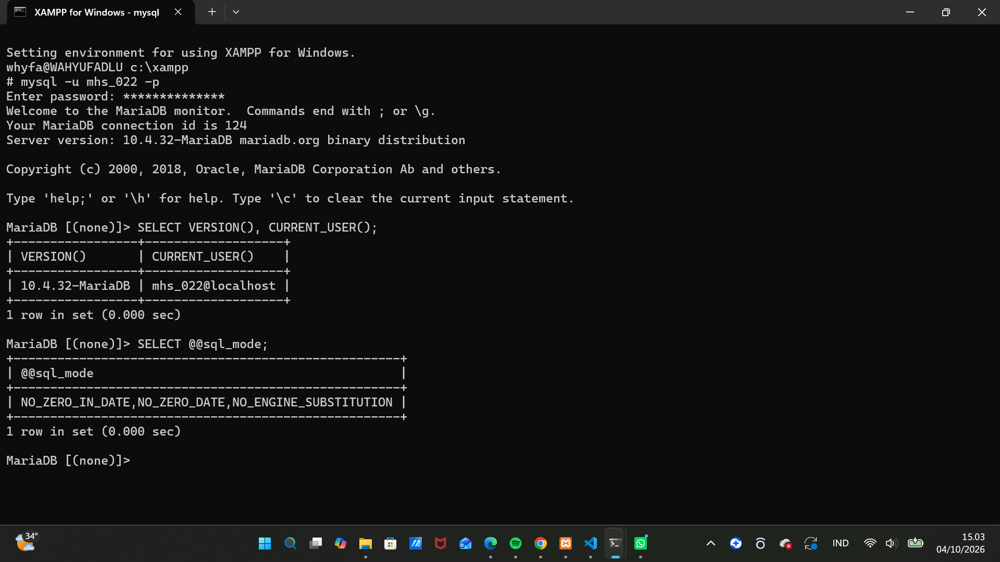
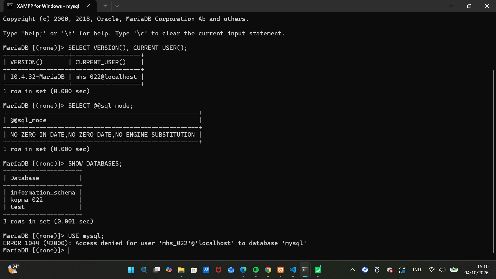
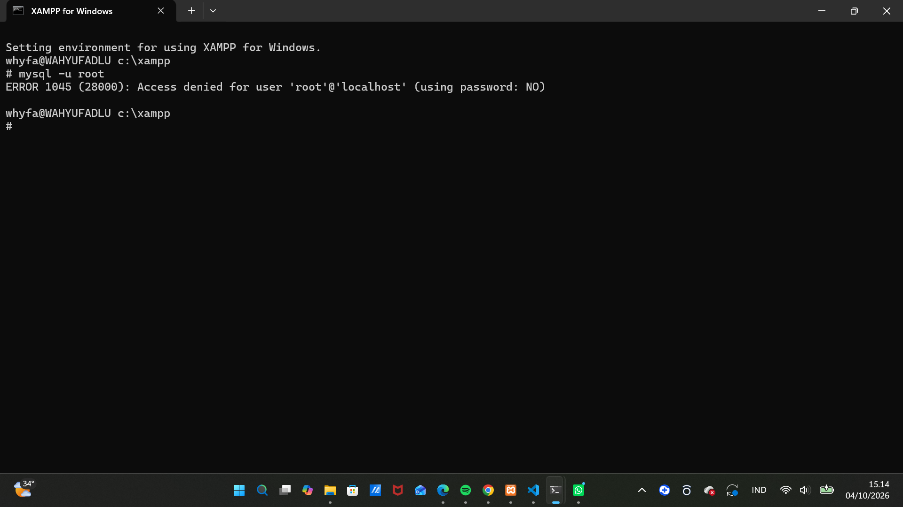
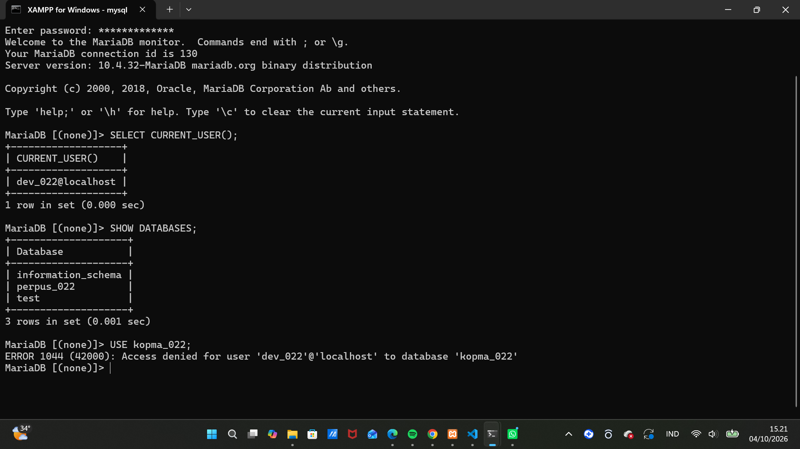
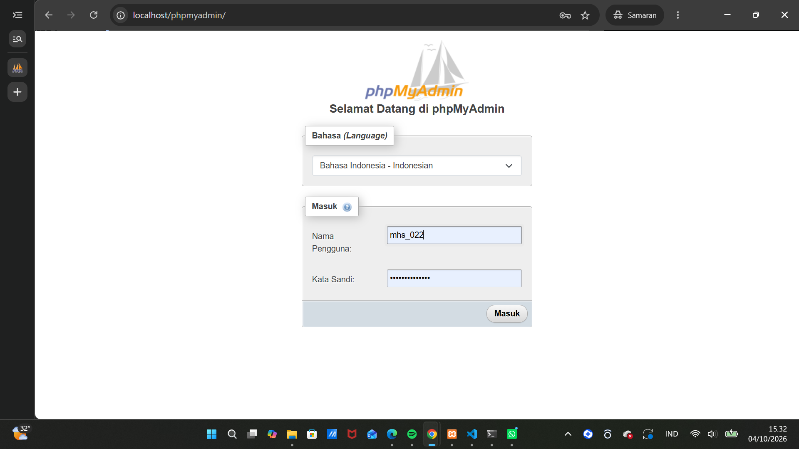
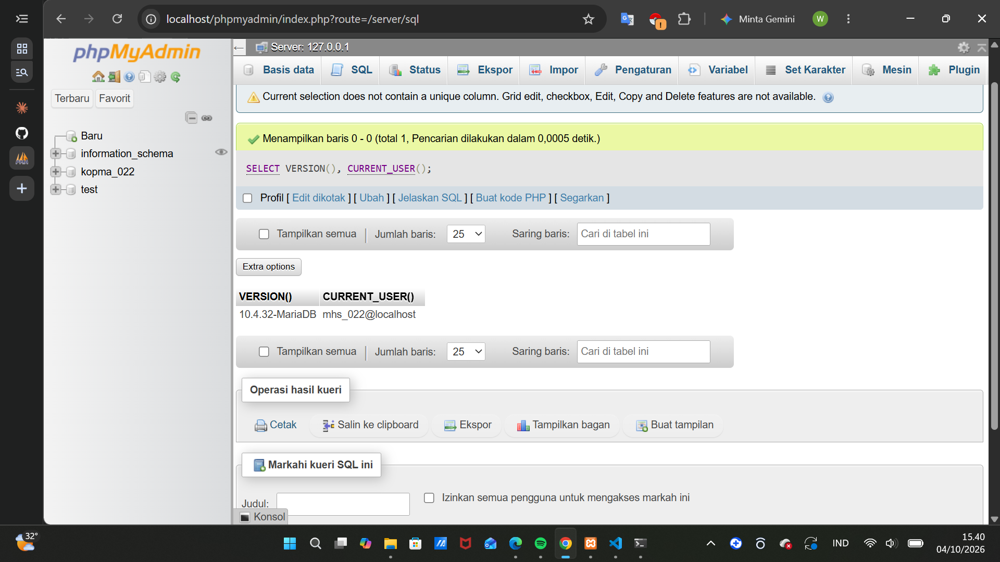
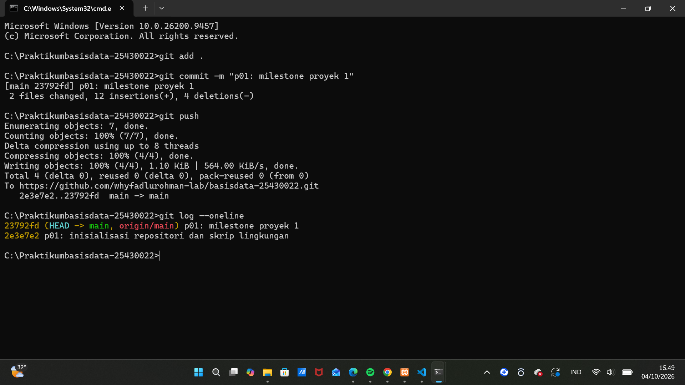
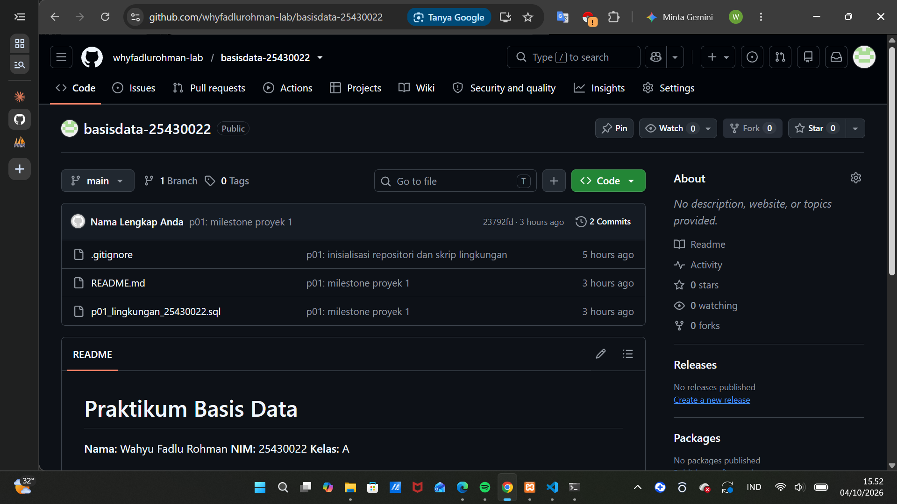
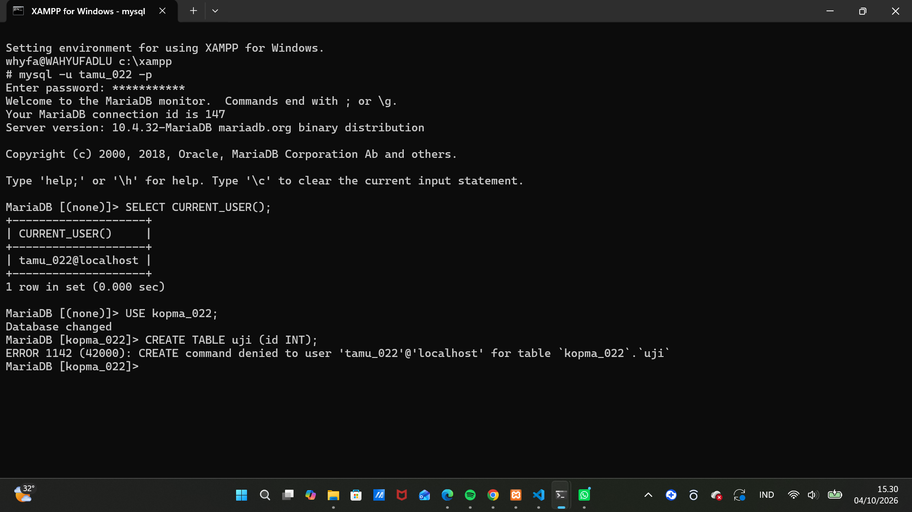

# Laporan Praktikum Basis Data - Pertemuan 01
**Nama:** Wahyu Fadlu Rohman **NIM:** 25430022 **Kelas:** A **Tanggal:** (04/10/2026)
**Dosen:** (Dedi Irawan, S.Kom.,M.T.I)

## 1. Tujuan Praktikum
1. Saya belajar menyalakan dan mematikan server MariaDB lewat XAMPP Control Panel, serta memahami arti status hijau dan port 3306.
2. Saya mencoba masuk ke server lewat baris perintah (CLI) dan phpMyAdmin, lalu membedakan kelebihan masing-masing.
3. Saya ingin terbiasa membaca pesan galat.
4. Saya memberi password pada akun root dan membuat akun kerja yang hanya boleh mengakses satu basis data, supaya data lebih aman.
5. Saya membuat basis data pertama dan menyimpan hasil kerja saya di Git, lalu mengunggahnya ke GitHub.

## 2. Ringkasan Dasar Teori
C.1 Basis Data dan Sistem Manajemen Basis Data
Basis data adalah kumpulan data yang saling berhubungan dan disimpan secara terorganisasi. Sedangkan DBMS adalah (database
management system).
C.2 Arsitektur Klien-Server MariaDB
MariaDB memakai pola klien-server. Server (mysqld) berjalan terus di latar belakang dan menunggu permintaan lewat port 3306, sedangkan klien seperti mysql (baris perintah) dan phpMyAdmin (web). Saya mengalaminya sendiri. ERROR 2002 muncul ketika klien tidak bisa terhubung ke server, misalnya karena MariaDB belum dijalankan, artinya masalahnya ada di jalur koneksi atau servernya belum aktif. ERROR 1045 muncul ketika saya login dengan username atau password yang salah, artinya koneksi sudah berhasil, tetapi server menolak akses saya. Dari kode galat itu saya tahu apakah masalahnya ada di koneksi ke server atau server sendiri yang menolak perintah saya, sehingga saya bisa langsung menentukan apa yang harus diperbaiki.
c.3 XAMPP sebagai Lingkungan Belajar
XAMPP adalah paket gratis yang menggabungkan server web Apache, server basis data MariaDB, bahasa PHP, dan aplikasi phpMyAdmin dalam satu pemasangan. Semua komponen dinyalakan dan dimatikan lewat XAMPP Control Panel. Label "MySQL" di XAMPP sebenarnya MariaDB, yaitu versi 10.4.32.
Karena MariaDB 10.4 sudah tidak menerima pembaruan keamanan (end-of-life), XAMPP hanya cocok untuk belajar SQL di lab, bukan untuk server produksi yang terhubung ke internet.
c.4 Dua Cara Berbicara dengan Server: CLI dan phpMyAdmin
Saya memakai dua cara untuk berbicara dengan server: CLI (klien teks mysql) dan phpMyAdmin (aplikasi web di peramban). CLI berbentuk teks di Command Prompt, sehingga perintahnya bisa disimpan sebagai skrip .sql dan diulang. phpMyAdmin berbentuk aplikasi web, sehingga cepat dipakai lewat klik, tetapi kliknya tidak meninggalkan jejak. Buku mewajibkan CLI lebih dulu karena perintahnya bisa diulang dan diuji, sedangkan phpMyAdmin berfungsi sebagai pendamping.
c.5 Akun, Host, dan Hak Akses
Di MariaDB, sebuah akun ditentukan oleh pasangan pengguna dan host, bukan hanya nama penggunanya, sehingga 'root'@'localhost' dan 'root'@'127.0.0.1' adalah dua akun berbeda. Bawaan XAMPP, akun root tidak diberi password, dan ini berbahaya karena siapa pun yang bisa menjangkau server memegang kendali penuh. Prinsip hak akses minimum (least privilege) berarti akun hanya diberi hak yang dibutuhkan. Karena itu, saya memakai root hanya untuk administrasi, sedangkan pekerjaan harian memakai akun kerja yang hanya berhak atas satu basis data.
c.6 Git sebagai Catatan Kerja
Git adalah sistem kendali versi yang mencatat setiap perubahan berkas dalam bentuk commit. Di praktikum ini, Git saya pakai untuk menyimpan skrip SQL dan dokumen proyek dan untuk membuktikan bahwa proyek saya dikerjakan bertahap. Alurnya: berkas di folder kerja dipilih dengan git add, dicatat dengan git commit, lalu dikirim ke GitHub dengan git push.
Riwayat commit dinilai karena menjadi bukti proses pengerjaan proyek saat UTS dan UAS.

## 3. Hasil Langkah Percobaan
### 3.1 Versi server dan mode SQL

Saya masuk sebagai `mhs_022` (`mysql -u mhs_022 -p`) dan menjalankan `SELECT VERSION(), CURRENT_USER();`. Hasilnya menunjukkan versi `10.4.32-MariaDB`, yang membuktikan bahwa server yang berjalan adalah MariaDB (bukan MySQL) dan akun yang dipakai adalah `mhs_022@localhost`. Awalnya `sql_mode` belum memuat `[MODE_BARU]`, karena isinya hanya `STRICT_TRANS_TABLES`, `ERROR_FOR_DIVISION_BY_ZERO`, `NO_AUTO_CREATE_USER`, dan `NO_ENGINE_SUBSTITUTION`, sehingga saya menambahkannya di `my.ini` lalu me-restart MariaDB lewat XAMPP Control Panel. Setelah itu `sql_mode` memuat `[MODE_BARU]`, artinya server sudah memakai aturan yang lebih ketat sesuai pengaturan yang saya tetapkan.

### 3.2 Akun kerja hanya melihat basis datanya, galat 1044

Saya masuk sebagai `mhs_022@localhost`, lalu menjalankan `SHOW DATABASES;` dan daftar yang tampil hanya `information_schema`, `kopma_022`, dan `test`. Ketika saya menjalankan `USE mysql;`, server menolak dengan galat `ERROR 1044 (42000)` dan pesan `Access denied for user 'mhs_022'@'localhost' to database 'mysql'`. Artinya login berhasil, tetapi akun `mhs_022` tidak berhak atas basis data `mysql`, sehingga akun kerja tidak bisa menyentuh data akun dan pengaturan server, sesuai prinsip hak akses minimum.

### 3.3 Root berpassword, galat 1045

Saya menjalankan `mysql -u root` tanpa opsi `-p`, lalu server menolak dengan galat `ERROR 1045 (28000)` dan keterangan `using password: NO`. Artinya klien tidak mengirim password, padahal root sudah berpassword, sehingga login harus memakai `mysql -u root -p`.

### 3.4 Akun proyek dev_022

Saya masuk sebagai `dev_022@localhost`, lalu menjalankan `SHOW DATABASES;`. Daftar yang tampil hanya `information_schema`, `perpus_022`, dan `test`. Saat saya menjalankan `USE kopma_022;`, muncul `ERROR 1044 (42000): Access denied`. Artinya, login berhasil tetapi `dev_022` tidak berhak atas `kopma_022`, sehingga data praktik terisolasi dari akun proyek.

### 3.5 phpMyAdmin mode cookie

Saya mengubah `auth_type` di `config.inc.php` dari `config` menjadi `cookie`, lalu phpMyAdmin menampilkan halaman login. Saya masuk sebagai `mhs_022`, dan kueri `SELECT VERSION(), CURRENT_USER();` di tab SQL menampilkan `10.4.32-MariaDB` dan `mhs_022@localhost`. Artinya, phpMyAdmin tidak lagi masuk otomatis sebagai root, dan hak aksesnya sama dengan di CLI.

### 3.6 Git dan GitHub

Saya menjalankan git add, git commit, dan git push dari folder C:\Praktikumbasisdata-25430022. Hasil git log --oneline menunjukkan riwayat commit yang berhasil dikirim ke repositori GitHub basisdata-25430022, yaitu commit awal "p01: inisialisasi repositori dan skrip lingkungan" dan commit terbaru "p01: milestone proyek 1".

## 4. Jawaban Titik Analisis
### Titik Analisis 1
Jawaban: Label "MySQL" di XAMPP sebenarnya adalah MariaDB 10.4.32, sehingga hasil pencarian "MySQL" bisa tidak cocok untuk server yang saya pakai.
Alasannya: Keduanya sudah berkembang berbeda. Dokumentasi MySQL cukup untuk SQL dasar, tetapi hal spesifik versi (my.ini, sql_mode, kode galat) harus dari dokumentasi MariaDB.
Bukti di praktik saya: SELECT VERSION(); menampilkan 10.4.32-MariaDB.
### Titik Analisis 2
Jawaban: Saat saya menjalankan mysql -u root tanpa -p, muncul ERROR 1045 (28000). karena klien tidak mengirim password sama sekali.
Alasannya: Di MariaDB, akun root membutuhkan password. Tanpa -p, klien tidak mengirim password, sehingga server menolak otentikasinya. Penentunya ada di akhir pesan, yaitu using password: NO. Kalau tertulis YES, berarti password dikirim tetapi salah.
Bukti di praktik saya: Saat saya menjalankan mysql -u root tanpa -p, muncul ERROR 1045 (28000) ... (using password: NO). Server tetap menjawab, jadi ini bukan masalah koneksi, melainkan masalah otentikasi.
### Titik Analisis 3
Jawaban: information_schema terlihat karena berisi metadata, sedangkan mysql ditolak karena di luar hak mhs_022 (ERROR 1044).
Alasannya: Setiap akun boleh melihat metadata objek yang berhak diaksesnya. Hak mhs_022 hanya kopma_022.*, sedangkan mysql adalah basis data sistem. Pada 1044 login berhasil tetapi tidak berhak, pada 1045 login ditolak.
Bukti di praktik saya: SHOW DATABASES; hanya menampilkan information_schema dan kopma_022, dan akses ke mysql ditolak.
### Titik Analisis 4
Jawaban: Mode cookie lebih aman karena pengguna harus login sendiri, sedangkan config masuk otomatis sebagai root.
Alasannya: Pada config, kredensial tersimpan di config.inc.php dalam teks biasa sehingga siapa pun di komputer itu memegang kendali penuh. Pada cookie, password tidak tersimpan di berkas konfigurasi, sejalan dengan hak akses minimum.
Bukti di praktik saya: Dengan mode cookie, phpMyAdmin menampilkan halaman login, dan saya masuk sebagai mhs_022, bukan root.
### Perbedaan galat 1044, 1045, dan 1142
galat 1044 USE mysql; sebagai mhs_022, USE kopma_022; sebagai dev_022, login berhasil, tetapi akun tidak berhak atas basis data itu. 1045 root tanpa -p, atau nama pengguna dan password salah, login ditolak: password tidak dikirim atau salah. 1142 CREATE TABLE uji sebagai tamu_022, akun berhak masuk dan membaca, tetapi tidak berhak menjalankan perintah itu (hanya SELECT).

## 5. Hasil Latihan dan Modifikasi
### Latihan 1: akun tamu_022 (galat 1142)

### Latihan 2: skrip dapat dijalankan ulang
![IF NOT EXISTS membuat perintah CREATE hanya berjalan kalau objeknya belum ada, sehingga skrip aman dijalankan berulang. Tanpa itu, membuat basis data atau akun yang sudah ada menghasilkan galat (ERROR 1007 untuk basis data, ERROR 1396 untuk akun) dan skrip bisa berhenti di tengah jalan. Bukti di praktik saya: Skrip p01_lingkungan_25430022.sql memakai CREATE DATABASE IF NOT EXISTS kopma_022 dan CREATE USER IF NOT EXISTS 'mhs_022'@'localhost'. Saya menjalankannya dua kali dengan mysql -u root -p < p01_lingkungan_25430022.sql, dan keduanya selesai tanpa galat.](img/p01_08_skrip_ulang.png)

## 6. Tugas Mandiri: Milestone Proyek 01
(Tema, basis data perpus_022, akun dev_022, bukti isolasi, README, .gitignore, nama file).
Tema proyek: Sistem basis data perpustakaan (perpus_022).
Bukti isolasi:  Pada gambar terlihat bahwa saya masuk sebagai `dev_022@localhost`. Daftar basis data yang terlihat oleh akun ini hanya `information_schema`, `perpus_022` dan `test`. Ketika saya menjalankan `USE kopma_022;`, muncul galat `ERROR 1044 (42000): Access denied for user 'dev_022'@'localhost' to database 'kopma_022'`. Artinya, akun `dev_022` berhasil login tetapi tidak berhak atas basis data `kopma_022`, sehingga data praktik tidak bisa dilihat atau diubah dari akun proyek.
Keputusan desain: Saya membuat akun `dev_022` terpisah dari `mhs_022` agar data proyek tidak tercampur dengan data praktik. Dengan hak hanya pada `perpus_022`, kesalahan perintah atau kebocoran akun ini hanya berdampak pada basis data proyek (hak akses minimum). Password di berkas SQL saya ganti dengan penanda dan saya membuat `.gitignore` karena berkas diunggah ke GitHub dan bisa dibaca orang lain. Saya memilih `utf8mb4` agar semua karakter, termasuk huruf beraksen dan emoji, tersimpan dengan benar.
Nama file: p01_lingkungan_25430022.sql Skrip pembuatan basis data `kopma_022` dan `perpus_022` serta akun `mhs_022` dan `dev_022`, dengan password berupa penanda.
laporan/p01_laporan_25430022.md Laporan praktikum.
laporan/img/p01_04_dev.png Tangkapan layar bukti, termasuk bukti isolasi akun `dev_022`.
README.md Penjelasan proyek dan cara menjalankan skrip.
.gitignore Mencegah berkas sensitif ikut ter-commit.

## 7. Pembahasan dan Kendala
ERROR 1045 (using password: NO) pada root
Saya menjalankan `mysql -u root` tanpa `-p`, lalu muncul `ERROR 1045 (28000): Access denied for user 'root'@'localhost' (using password: NO)`.
Pesan ini berarti server hidup dan menjawab, tetapi menolak login karena klien tidak mengirim password. Penentunya ada di akhir pesan, yaitu `using password: NO`. Jadi ini masalah autentikasi, bukan masalah koneksi.
Cara mengatasi: Lalu saya menjalankan `mysql -u root -p`, lalu memasukkan password saat diminta.

## 8. Kesimpulan
Pada praktikum ini saya berhasil menyiapkan server MariaDB yang berjalan dengan akun root berpassword, akun `mhs_022` dan `dev_022` yang terbatas pada satu basis data, serta repositori Git yang terhubung ke GitHub, sehingga lingkungan kerja siap dipakai dan bisa dibuat ulang lewat skrip.
Saya belajar bahwa prinsip hak akses minimum membatasi dampak sebuah akun, terbukti dari ERROR 1044 saat `mhs_022` membuka `mysql` dan ERROR 1142 saat `tamu_022` membuat tabel.
Pengalaman menemui galat ERROR 2002 mengajarkan saya bahwa server belum menyala, sedangkan ERROR 1045 dengan `using password`: NO atau `YES` menunjukkan password tidak dikirim atau salah.
Ke depan, saya akan membaca pesan galat dengan tenang tanpa rasa takut seperti pada saat saya belum tahu pesan galat seperti apa, menyimpan skrip di Git tiap pertemuan, dan mulai menyusun dokumen kebutuhan data proyek Perpustakaan Cendekia WFR di Modul 2.

## 9. Pernyataan Penggunaan AI
(alat, untuk apa, bagian mana)
Alat yang dipakai: Claude (Anthropic).
Dipakai untuk: Memandu langkah instalasi dan konfigurasi: perintah MariaDB (akun, hak akses, basis data), konfigurasi phpMyAdmin mode cookie, serta perintah Git dan GitHub.
Menjelaskan pesan galat yang saya temui (ERROR 2002, 1045, 1044, 1142) dan cara mengatasinya.
Memberi kerangka dan pola kalimat untuk beberapa bagian laporan saja.
Menjelaskan konsep Dasar Teori dan memberi masukan tata bahasa yang benar pada draf yang saya tulis.
Bagian yang terbantu: Bagian 2 Ringkasan Dasar Teori, Milestone Proyek 1, Bagian 4 Titik Analisis, dan bagian 8 kesimpulan.
Alat kedua: Google Gemini.
digunakan untuk membantu menyusun dan merapikan redaksi kalimat penjelasan pada subbab 3.6 Git dan GitHub. Gemini membantu mengubah instruksi kerja teknis—seperti pelaksanaan perintah git add, git commit, git push, peninjauan git log --oneline, serta pengelolaan repositori basisdata-25430022—menjadi paragraf laporan praktikum yang terstruktur, padat, dan akademis.

## 10. Bukti Git
- Repositori: https://github.com/whyfadlurohman-lab/basisdata-25430022
- Commit: 2e3e7e2 p01: inisialisasi repositori dan skrip lingkungan
- Commit: 23792fd p01: milestone proyek 1

## Checklist
| Checklist | Keterangan |
|---|---|
| ☑️ | Identitas: nama, NIM, kelas, pertemuan ke-N, tanggal, nama dosen |
| ☑️ | Tujuan ditulis ulang dengan bahasa sendiri (maksimal 5 baris) |
| ☑️ | Ringkasan teori: pemahaman sendiri, maksimal setengah halaman, tanpa menyalin buku |
| ☑️ | Langkah percobaan (D): tangkapan layar hasil langkah kunci, masing-masing diberi keterangan |
| ☑️ | Titik Analisis: semua dijawab lengkap dengan alasan |
| ☑️ | Latihan (E): skrip/dokumen hasil latihan beserta bukti berjalan |
| ☑️ | Tugas Mandiri (F): milestone proyek, berkas, bukti, dan penjelasan keputusan desain |
| ☑️ | Pembahasan dan kendala: galat yang ditemui, cara membaca, cara mengatasi |
| ☑️ | Kesimpulan: dua sampai empat kalimat dengan bahasa sendiri |
| ☑️ | Pernyataan Penggunaan AI |
| ☑️ | Bukti Git: tautan repositori dan kode commit pertemuan ini |
| ☑️ | Keaslian: setiap tangkapan layar memperlihatkan akun dan jam sistem; nama objek memuat NIM/inisial |

### Checklist Khusus Pertemuan 1

| Checklist | Keterangan |
|---|---|
| ☑️ | Berkas wajib: p01_lingkungan_25430022.sql (dapat dijalankan ulang), README.md berisi Identitas Proyek, .gitignore |
| ☑️ | Bukti tangkapan layar: SELECT VERSION(), CURRENT_USER(); SELECT @@sql_mode; SHOW DATABASES sebagai mhs_022 dan dev_022; galat 1044 dan 1142; halaman masuk phpMyAdmin mode cookie; git push pertama |
| ☑️ | Analisis wajib: Titik Analisis 1-4; perbedaan kode galat 1044, 1045, dan 1142 |