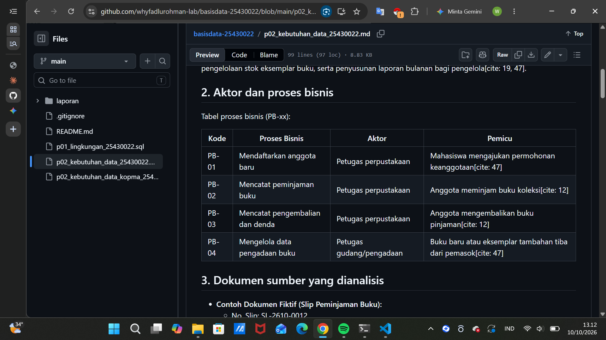
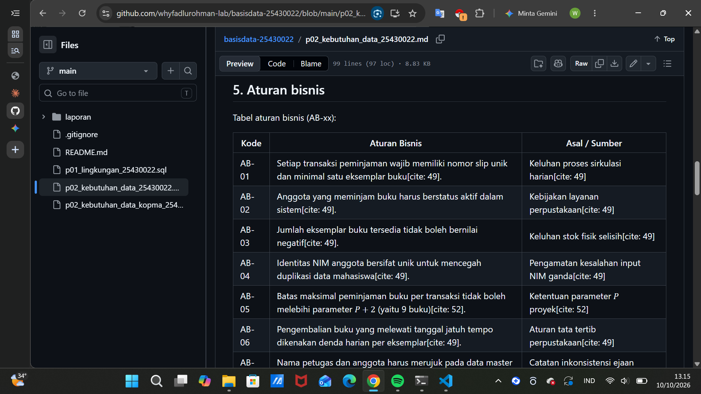
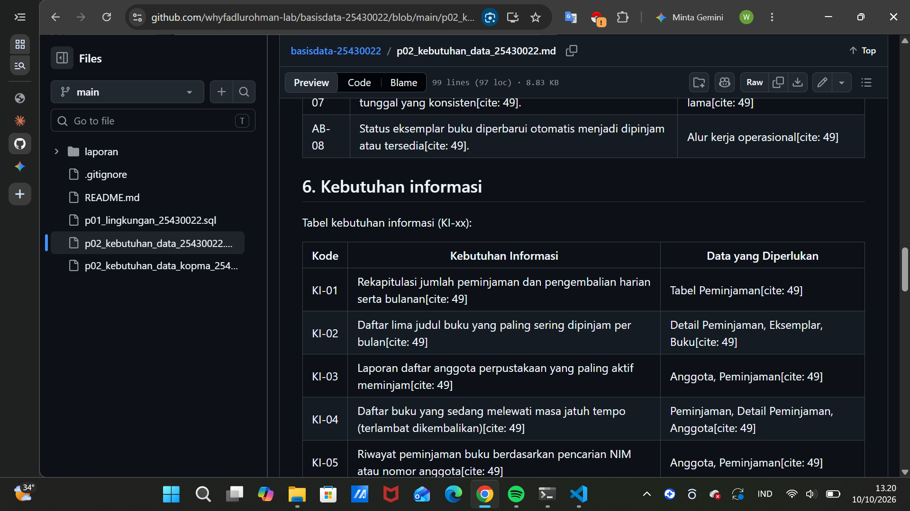
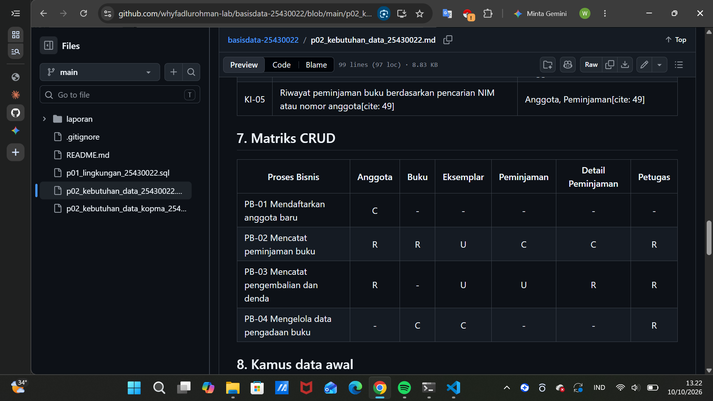
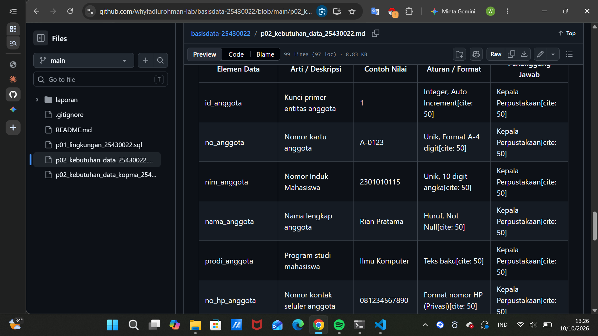
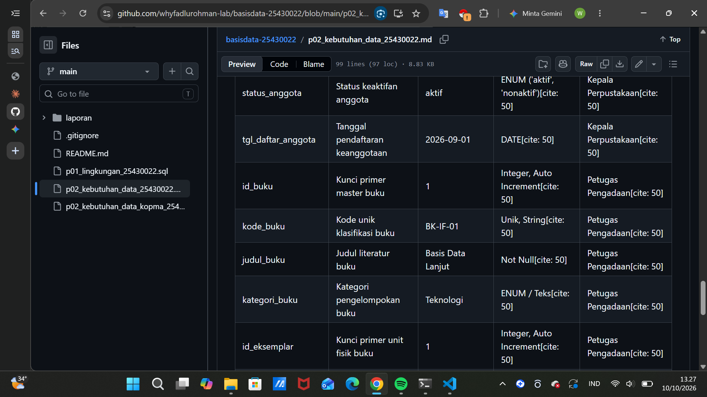
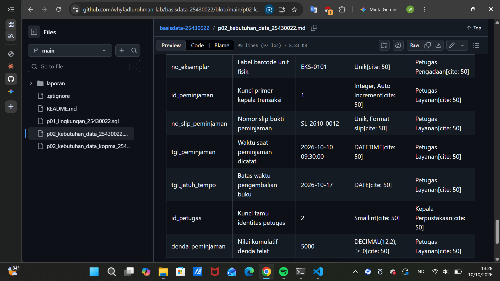
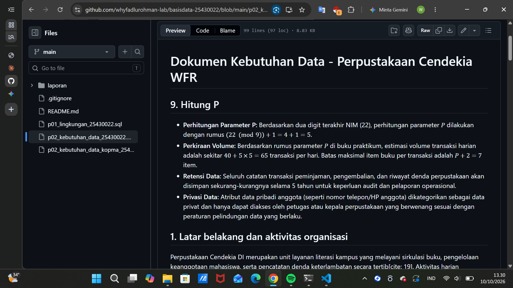

# Laporan Praktikum Basis Data - Pertemuan 02
**Nama:** Wahyu Fadlu Rohman **NIM:** 25430022 **Kelas:** A **Tanggal:** (10/10/2026)
**Dosen:** (Dedi Irawan, S.Kom.,M.T.I)

## 1. Tujuan Praktikum
* Mengidentifikasi aktivitas organisasi, aktor, dan proses bisnis dari narasi serta dokumen sumber[cite: 43].
* Menurunkan elemen data, entitas kandidat, dan aturan bisnis yang terukur[cite: 43].
* Menyusun matriks proses-data (CRUD) dan kamus data awal dengan penanggung jawab data (*data steward*)[cite: 43].
* Menulis pernyataan kebutuhan data dan informasi yang spesifik serta dapat diuji[cite: 43].

## 2. Ringkasan Dasar Teori
Sebelum mulai membuat tabel atau menulis kode SQL di sistem, tahap awal yang paling penting adalah melakukan analisis kebutuhan[cite: 43, 44]. Jika dari awal perancangan ini ada yang terlewat, kesalahannya baru akan ketahuan di tahap akhir saat basis data sudah jadi, yang mana biayanya bakal jauh lebih besar untuk memperbaikinya[cite: 44]. Oleh karena itu, modul ini melatih kita untuk memandang data sebagai aset organisasi yang memiliki aturan, tata kelola, dan penanggung jawab yang jelas[cite: 44].

## 3. Hasil Langkah Percobaan (tangkapan layar + keterangan)
* *(Tangkapan layar hasil pengerjaan analisis proses bisnis, tabel aturan bisnis, hingga matriks CRUD yang telah di-push ke repositori GitHub disimpan dalam folder `laporan/img/`)*[cite: 27].
* **Keterangan:** Seluruh alur proses, aturan, dan entitas untuk studi kasus proyek perpustakaan sudah saya analisis dan tuangkan ke dalam berkas `p02_kebutuhan_data_25430022.md`[cite: 27].
### 3.1 Tabel Proses Bisnis (PB)

Tabel ini memuat [isi jumlah] proses bisnis perpustakaan, yaitu [sebut 2-3 contoh], lengkap dengan aktor dan pemicunya.
### 3.2 Tabel Aturan Bisnis (AB)

Tabel ini memuat [isi jumlah] aturan bisnis, antara lain [sebut 1-2 contoh, misalnya yang memakai nilai P].
### 3.3 Tabel Kebutuhan Informasi (KI)

Tabel ini memuat [isi jumlah] kebutuhan informasi, antara lain [sebut 1-2 contoh laporan] beserta data yang diperlukan.
### 3.4 Matriks CRUD

Matriks ini memetakan [isi jumlah] proses bisnis terhadap [isi jumlah] entitas. Setiap entitas memiliki minimal satu huruf C, yaitu [sebut proses pembuatnya atau alasan bila ada pengecualian].
### 3.5 Kamus Data (bagian 1)

Bagian awal kamus data memuat elemen dari entitas [sebut entitasnya] beserta arti, contoh, aturan, dan penanggung jawab.
### 3.6 Kamus Data (bagian 2)
 
Lanjutan kamus data memuat elemen dari entitas [sebut entitasnya]. Secara total kamus data berisi [isi jumlah] elemen.
### 3.7 Perhitungan Parameter P

Dengan NIM 25430022, dua digit terakhirnya adalah 22. Nilai P = (22 mod 9) + 1 = 5, sehingga batas item per transaksi = 7, denda harian = Rp5.000, dan perkiraan volume harian = 65 transaksi.

## 4. Jawaban Titik Analisis
* **Titik Analisis 1:** Kenapa harga pada nota harus disimpan sendiri per baris transaksi padahal di data master barang sudah ada harganya? Jawabannya adalah agar riwayat harga di nota-nota lama tidak ikut berubah atau rusak ketika terjadi penyesuaian harga barang di kemudian hari[cite: 48]. Ini solusi untuk mengatasi kebingungan saat melacak transaksi masa lalu.
* **Titik Analisis 2:** Total dan subtotal itu merupakan nilai turunan dari hasil perkalian jumlah barang (*qty*) dengan harga, jadi kenapa tidak disimpan saja? Alasan utamanya agar terhindar dari inkonsistensi data kalau komponen utamanya sewaktu-waktu diubah[cite: 48, 64]. Walau terkadang ada yang memilih menyimpan total untuk mempercepat laporan, dalam perancangan ini nilai tersebut dihitung ulang dari rinciannya guna menjaga integritas[cite: 48, 64].
* **Titik Analisis 3:** Kenapa di kolom pemasok pada matriks CRUD tidak ada huruf 'C' (*Create*)? Karena di awal, proses untuk mencatat atau menambah data pemasok belum didefinisikan sebagai proses mandiri, sehingga kita perlu menambahkan proses baru seperti pengelolaan pengadaan barang[cite: 49, 50].

## 5. Hasil Latihan dan Modifikasi
* **Latihan E.1 (Poin Loyalitas):** Saya menambahkan aturan baru di mana setiap kelipatan belanja tertentu, anggota akan mendapatkan poin yang dapat ditukar dengan potongan harga, lengkap dengan penyesuaian aturan bisnis (AB-09) dan matriks CRUD-nya.
* **Latihan E.2 (Perbaikan Pernyataan Kabur):**
  1. *Sebelum:* "Data anggota harus aman." $\rightarrow$ *Sesudah:* "Nomor HP anggota dikategorikan sebagai data pribadi yang hanya boleh diakses melalui view khusus oleh kepala perpustakaan."
  2. *Sebelum:* "Sistem harus cepat mencari barang." $\rightarrow$ *Sesudah:* "Pencarian data buku berdasarkan kode atau judul harus menghasilkan data dalam waktu kurang dari 1 detik menggunakan indeks pada kolom kunci."
  3. *Sebelum:* "Laporan stok harus akurat." $\rightarrow$ *Sesudah:* "Laporan stok menampilkan jumlah ketersediaan fisik riil dengan batasan nilai stok tidak boleh bernilai negatif."

  ## 6. Tugas Mandiri: Milestone Proyek 02
* Berkas dokumen kebutuhan data untuk proyek perpustakaan sudah saya buat dengan nama **`p02_kebutuhan_data_25430022.md`** di dalam repositori[cite: 27].
* Di dalamnya sudah memuat:
  - 4 proses bisnis utama di perpustakaan.
  - 6 entitas kandidat beserta atributnya.
  - 8 aturan bisnis (AB-01 sampai AB-08).
  - 5 daftar kebutuhan informasi (KI-01 sampai KI-05).
  - Matriks CRUD yang saling terhubung tanpa ada entitas yang terabaikan.
  - Kamus data awal yang memuat lebih dari 20 elemen data lengkap dengan kolom penanggung jawabnya (*data steward*)[cite: 50].
  - Bagian non-fungsional yang mencakup perhitungan parameter $P$ berdasarkan NIM 25430022 ($P = (22 \pmod 9) + 1 = 5$, estimasi transaksi harian $\approx 65$ transaksi), aturan retensi data selama 5 tahun, dan batasan privasi data pribadi[cite: 45, 50, 52].
  - Rancangan dokumen sumber fiktif berupa Slip Peminjaman Buku beserta tabel pembedahannya[cite: 52].

  ## 7. Pembahasan dan Kendala
  * *Kendala:* Awalnya saya sempat agak bingung saat menghitung parameter $P$ serta memastikan semua entitas di matriks CRUD memiliki proses pembuatan datanya masing-masing (*Create*).
  * *Solusi:* Saya membaca kembali petunjuk di buku modul halaman 23 dan merapikan ulang relasi antar proses bisnis agar matriks CRUD-nya benar-benar logis dan konsisten[cite: 52, 53].

## 8. Kesimpulan
* Analisis kebutuhan data ini sangat membantu dalam mengenali bentuk dan aturan data yang akan kita bangun agar terhindar dari kesalahan di tengah jalan[cite: 11, 43].
* Dengan adanya dokumen kebutuhan data, proses bisnis, aturan, matriks CRUD, dan kamus data, arah perancangan basis data jadi memiliki panduan yang jelas dan terstruktur[cite: 43, 45].

## 9. Pernyataan Penggunaan AI
* Asisten AI (Claude dan Gemini) digunakan secara proporsional untuk membantu memahami alur instruksi praktikum, mendiskusikan konsep dasar analisis kebutuhan data, serta merapikan format penulisan laporan dalam bentuk Markdown. Seluruh isi dokumen kebutuhan data, penjabaran aturan bisnis, dan milestone proyek dikerjakan dan disesuaikan sendiri berdasarkan ketentuan NIM saya.

## 10. Bukti Git
* **Tautan Repositori:** `https://github.com/username/basisdata-25430022`[cite: 16]
* **Hash Commit:** `git log --oneline` tercatat dengan pesan: `p02: dokumen kebutuhan data proyek`[cite: 14, 16]

## Checklist
### Checklist umum (Tabel P.13)

| Ceklis | Keterangan |
|:---:|---|
| ☑️ | **Identitas:** nama, NIM, kelas, pertemuan ke-2, tanggal pelaksanaan, nama asisten/dosen |
| ☑️ | **Tujuan:** ditulis ulang dengan bahasa sendiri (maksimal 5 baris) |
| ☑️ | **Ringkasan teori:** pemahaman sendiri, maksimal setengah halaman, tanpa menyalin buku |
| ☑️ | **Langkah percobaan (D):** tangkapan layar hasil langkah kunci, masing-masing diberi keterangan singkat |
| ☑️ | **Titik Analisis:** semua dijawab lengkap dengan alasan, bukan sekadar ya/tidak |
| ☑️ | **Latihan (E):** dokumen hasil latihan beserta buktinya |
| ☑️ | **Tugas Mandiri (F):** milestone proyek 2: berkas, bukti, dan penjelasan keputusan desain |
| ☑️ | **Pembahasan dan kendala:** kendala yang ditemui, cara membacanya, dan cara mengatasinya |
| ☑️ | **Kesimpulan:** dua sampai empat kalimat dengan bahasa sendiri |
| ☑️ | **Pernyataan Penggunaan AI:** alat yang dipakai, untuk apa, dan bagian mana |
| ☑️ | **Bukti Git:** tautan repositori dan kode commit (hash) pertemuan ini dengan pesan p02: ... |
| ☑️ | **Keaslian:** setiap tangkapan layar memperlihatkan identitas ber-NIM dan jam sistem; nama organisasi memuat inisial saya |

### Checklist khusus Pertemuan 2 (Tabel 2.9)

| Ceklis | Keterangan |
|:---:|---|
| ☑️ | **Berkas wajib:** p02_kebutuhan_data_kopma_NIMLENGKAP.md dan p02_kebutuhan_data_NIMLENGKAP.md (proyek) |
| ☑️ | **Bukti tangkapan layar:** tabel PB, AB, KI, matriks CRUD, dan kamus data di berkas proyek (tampilan GitHub) |
| ☑️ | **Analisis wajib:** Titik Analisis 1-3; perhitungan parameter P; perbaikan tiga pernyataan kebutuhan kabur |